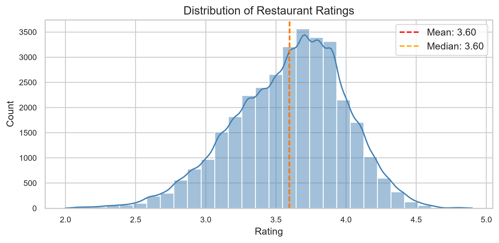
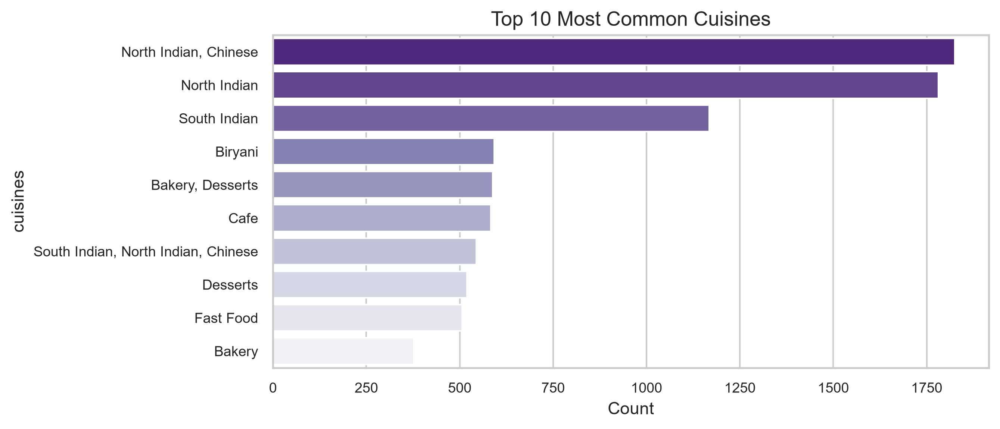
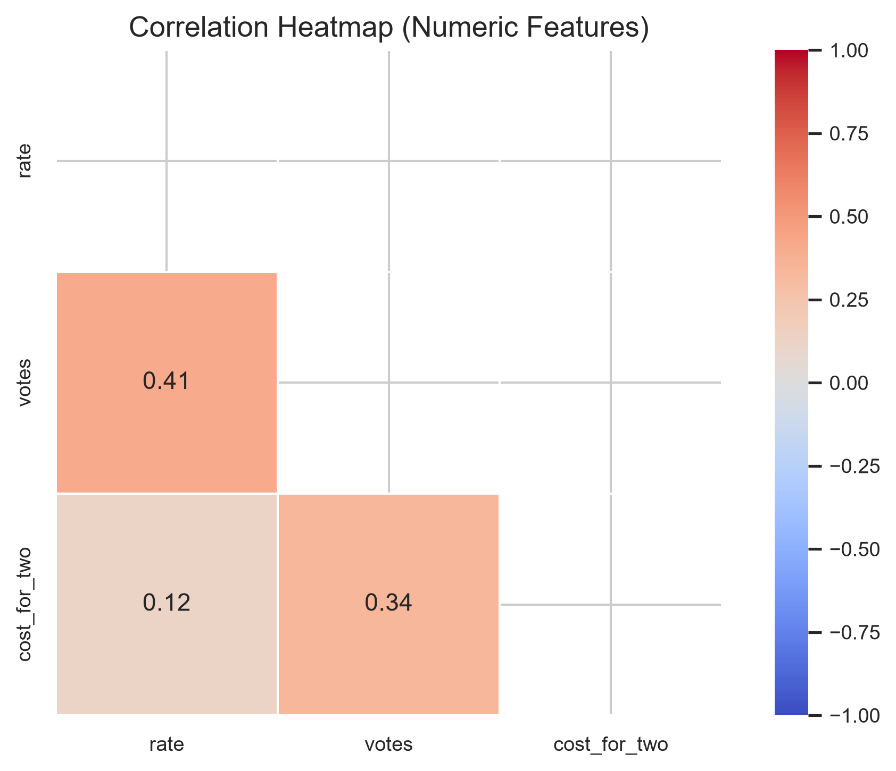

# 🍽️ Zomato Restaurant Data Analysis (EDA)

## 📌 Project Overview

This project performs **Exploratory Data Analysis (EDA)** on the **Zomato Bangalore Restaurant Dataset** to uncover meaningful insights about restaurant ratings, pricing, customer preferences, cuisines, online ordering, and table booking facilities.

The analysis includes data cleaning, preprocessing, visualization, feature engineering, and business recommendations to better understand restaurant trends and customer behavior.
---

## 🎯 Project Objectives

- Clean and preprocess the raw dataset.
- Handle missing values and duplicates.
- Detect and analyze outliers.
- Perform univariate and bivariate analysis.
- Engineer new features for deeper insights.
- Generate business insights using visualizations.

---

## 📂 Project Structure

```
Zomato-EDA/
│
├── data/
│   ├── zomato.csv
│   └── cleaned_zomato.csv
│
├── images/
│   ├── rating_distribution.png
│   ├── votes_distribution.png
│   ├── cost_for_two_distribution.png
│   ├── online_order_acceptance.png
│   ├── table_booking_availability.png
│   ├── top_10_locations.png
│   ├── restaurant_type_distribution.png
│   ├── listed_type_distribution.png
│   ├── top_10_cuisines.png
│   ├── online_order_vs_rating.png
│   ├── table_booking_vs_rating.png
│   ├── cost_for_two_vs_rating.png
│   ├── votes_vs_rating.png
│   ├── average_rating_by_location.png
│   ├── online_order_vs_cost_for_two.png
│   ├── average_cost_by_restaurant_type.png
│   └── correlation_heatmap.png
│
├── notebooks/
│   └── Zomato_EDA.ipynb
│
├── requirements.txt
├── README.md
└── LICENSE
```

---

## 🛠️ Technologies Used

- Python
- Pandas
- NumPy
- Matplotlib
- Seaborn
- Jupyter Notebook

---

## 📊 Exploratory Data Analysis

### Data Cleaning

- Removed duplicate records
- Handled missing values
- Converted data types
- Cleaned rating and cost columns
- Renamed columns for better readability

---

### Univariate Analysis

- Rating Distribution
- Votes Distribution
- Cost for Two Distribution
- Online Order Availability
- Table Booking Availability
- Top Restaurant Locations
- Restaurant Type Distribution
- Listed Type Distribution
- Top 10 Cuisines

---

### Bivariate Analysis

- Online Order vs Rating
- Table Booking vs Rating
- Cost for Two vs Rating
- Votes vs Rating
- Average Rating by Location
- Online Order vs Cost
- Average Cost by Restaurant Type

---

### Correlation Analysis

- Correlation Heatmap
- Feature Relationships

---

### Feature Engineering

Created additional features such as:

- Cost per Person
- Popularity Score
- Rating Category

---

## 📈 Sample Visualizations

### Rating Distribution



---

### Top 10 Cuisines



---

### Correlation Heatmap



---

## 💡 Key Insights

- Most restaurants have ratings between **3.5 and 4.2**.
- North Indian cuisine is the most commonly served cuisine.
- Casual Dining is the dominant restaurant type.
- Restaurants offering online ordering generally receive higher customer engagement.
- Higher-rated restaurants tend to attract more customer votes.
- Restaurant cost alone does not strongly influence ratings.
- Some locations consistently perform better in terms of average ratings.

---

## 🚀 Future Improvements

- Build a Restaurant Recommendation System.
- Predict restaurant ratings using Machine Learning.
- Create an interactive Power BI Dashboard.
- Develop a Streamlit web application for restaurant analytics.

---

## ▶️ How to Run

Clone the repository

```bash
git clone https://github.com/bhavya-aggarwal011/Zomato-EDA.git
```

Move into the project directory

```bash
cd Zomato-EDA
```

Install dependencies

```bash
pip install -r requirements.txt
```

Launch Jupyter Notebook

```bash
jupyter notebook
```

Open

```
notebooks/Zomato_EDA.ipynb
```

Run all cells.

---

## 📌 Dataset

The dataset contains restaurant information including:

- Restaurant Name
- Location
- Rating
- Votes
- Online Order
- Table Booking
- Approximate Cost for Two
- Restaurant Type
- Listed Type
- Cuisines

---

## 📜 License

This project is intended for educational and portfolio purposes.

---

## 👨‍💻 Author

**Bhavya Aggarwal**